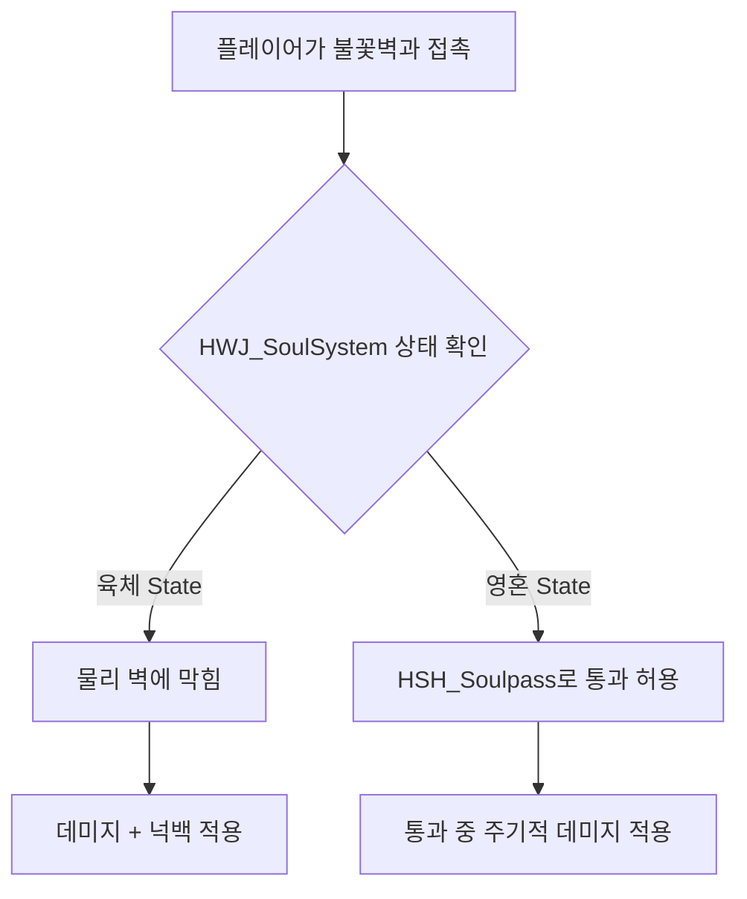

# 2026-08-11 HSH 불꽃벽 (Flame Wall) 기믹 개발 기록

## 1. 개발 목적
- 게임 내 **불꽃벽(Flame Wall)** 기믹을 구현함.
- **육체(Body) 상태**: 불꽃벽에 충돌하여 이동이 막히며, 닿았을 때 화염 데미지 및 넉백을 입음.
- **영혼(Soul/Spirit) 상태**: `HSH_Soulpass` 시스템과 연동되어 물리적 통과가 가능하지만, 불꽃벽 영역을 지나가는 동안 일정 주기(`damageInterval`)로 화염 데미지를 입음.

---

## 2. 주요 생성 스크립트

### 🔥 불꽃벽 기믹 스크립트
- **`HSH_FlameWall.cs`** (`Assets/02Scripts/HSH/Gimmick/HSH_FlameWall.cs`):
  - `HSH_Soulpass` 컴포넌트와 자동 필수 연결(`[RequireComponent]`)되어 영혼 상태의 통과 충돌 무시를 보장함.
  - `OnCollisionEnter2D`, `OnCollisionStay2D`, `OnTriggerEnter2D`, `OnTriggerStay2D` 이벤트를 모두 지원하여 물리 벽 상태 및 영혼 통과(트리거) 상태 모두에서 정밀하게 접촉을 감지함.
  - 플레이어의 현재 영혼/육체 상태(`HWJ_SoulSystem`)를 파악하고, `HWJ_RuntimeStatusSystem`을 통해 화염 데미지를 적용함.
  - 설정된 주기(`damageInterval`)마다 데미지를 주어 불꽃벽 내부에 머무르는 동안 지속 피해를 구현함.
  - 육체 상태일 때는 넉백(`hys_Player_Hit` 또는 `HWJ_KnockbackSystem`)을 적용하고, 영혼 상태일 때는 넉백 없이 부드럽게 통과하며 지속 데미지만 적용받도록 차별화함.

---

## 3. 유니티 인스펙터 오브젝트 배치 및 설정 가이드

### 🧱 1) 불꽃벽 게임오브젝트 설정
1. 씬 내 불꽃벽 오브젝트(예: `FlameWall_01`)를 생성하거나 선택합니다.
2. `HSH_FlameWall` 컴포넌트를 부착합니다. (부착 시 `Collider2D` 및 `HSH_Soulpass` 컴포넌트가 자동으로 부착됩니다.)
3. `Collider2D` (BoxCollider2D, TilemapCollider2D 등) 영역을 설정합니다.
   - 단일 물리 콜라이더만 사용할 경우, 영혼 상태에서는 `HSH_Soulpass`에 의해 `IgnoreCollision` 처리되므로, 필요에 따라 영혼 데미지 판정을 보장하기 위해 **Is Trigger가 체크된 추가 콜라이더(또는 자식 콜라이더)**를 함께 배치할 수 있습니다.

### ⚙️ 2) 인스펙터 주요 파라미터 설정
- **Damage**: 닿았을 때 입힐 피격 데미지 수치 (기본값: `10`)
- **Damage Interval**: 지속 피격 주기 (기본값: `0.5`초)
- **Damage In Body State**: 육체 상태 피격 허용 여부 (기본값: `true`)
- **Damage In Soul State**: 영혼 상태 피격 허용 여부 (기본값: `true`)
- **Apply Knockback In Body State**: 육체 상태 피격 시 넉백 밀쳐내기 여부 (기본값: `true`)
- **Knockback Power**: 넉백 세기 (기본값: `6`)
- **Visual & Audio (선택)**:
  - `Flame Particle`: 불꽃 연출 파티클
  - `Hit Effect Prefab`: 데미지 적용 시 생성될 이펙트 프리팹
  - `Damage Sfx`: 피격 사운드 오디오 클립 (`AudioSource` 연결)

---

## 4. 핵심 동작 흐름 및 연동 로직

