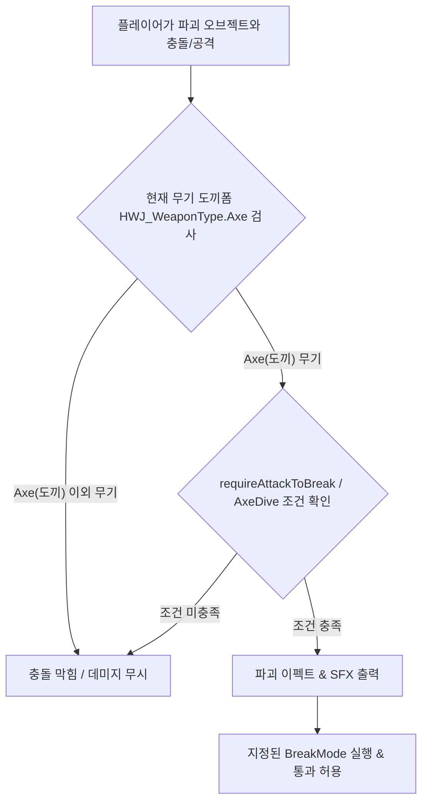

# 2026-08-12 HSH 도끼 폼(Axe) 전용 파괴 오브젝트 기믹 개발 기록

## 1. 개발 목적
- 게임 내 **도끼 폼(`HWJ_WeaponType.Axe`)** 상태에서 일반 공격, 스킬 공격 또는 물리/트리거 충돌 시 부서지는 파괴 오브젝트 기믹을 구현함.
- 도끼 폼이 아닌 상태(검, 창, 방패 등) 공격/충돌 시에는 파괴되지 않는 단단한 벽으로 동작함.
- 다양한 파괴 모드(`DisableObject`, `DestroyObject`, `DisableCollider`, `AnimatorTrigger`), 시각/음향 연출 및 파괴 후 자동 복구 기능(`respawnAfterTime`)을 제공함.

---

## 2. 주요 생성 스크립트

### 🪓 도끼 폼 파괴 기믹 스크립트
- **`HSH_AxeBreakableObject.cs`** (`Assets/02Scripts/HSH/Gimmick/HSH_AxeBreakableObject.cs`):
  - `TakeDamage` (일반 공격 메세지), `TryActivateFromSkillHit` (HWJ 스킬 히트 콜백), `OnCollisionEnter2D`, `OnCollisionStay2D`, `OnTriggerEnter2D`, `OnTriggerStay2D` 수신을 완벽 지원함.
  - `HWJ_WeaponGimmickActivatorUtility`, `HWJ_PossessionSystem`, `hys_Player_Axe` 컨트롤러 등 다중 탐색을 통해 충돌 대상의 현재 무기가 `HWJ_WeaponType.Axe`인지 다중 fallback으로 판정함.
  - 도끼 내려찍기(Axe Dive) 전용 파괴 옵션(`requireAxeDiveAttackOnly`) 및 공격 조건 선택 옵션(`requireAttackToBreak`)을 지원함.
  - 조건 충족 시 이펙트 생성, 파괴 sound(SFX) 재생 및 설정된 `BreakMode`에 맞춰 파괴 처리를 수행함.

---

## 3. 유니티 인스펙터 오브젝트 배치 및 설정 가이드

### 🧱 1) 도끼 파괴 오브젝트 설정
1. 부서질 환경 오브젝트(바위, 파괴 벽 등)에 `HSH_AxeBreakableObject` 컴포넌트를 추가합니다.
2. `Collider2D` (BoxCollider2D 등)를 추가하여 물리/트리거 판정 영역을 설정합니다.

### ⚙️ 2) 인스펙터 주요 파라미터 설정
- **Required Weapon Type**: 요구 무기 타입 (`Axe` 기본 지정)
- **Require Attack To Break**: 체크 시 도끼 공격에 명중해야만 파괴 (해제 시 도끼 폼으로 비비기만 해도 파괴)
- **Require Axe Dive Attack Only**: 체크 시 도끼 공중 내려찍기 공격(Axe Dive)으로만 파괴 가능하도록 제한
- **Break Mode**:
  - `DisableObject`: 오브젝트 비활성화 (`SetActive(false)`)
  - `DestroyObject`: 오브젝트 완전 삭제 (`Destroy`)
  - `DisableCollider`: 콜라이더 및 스프라이트만 비활성화 (투명 통과)
  - `AnimatorTrigger`: 지정된 애니메이션 Trigger 실행 후 비활성화
- **Break Effect Prefab**: 부서질 때 튀는 파티클/이펙트 프리팹
- **Break Sfx**: 파괴 사운드 오디오 클립 (`AudioSource` 연결)
- **Respawn After Time**: 일정 시간 후 장애물 자동 복구 여부 및 복구 딜레이 (`respawnDelay`)

---

## 4. 핵심 동작 흐름

